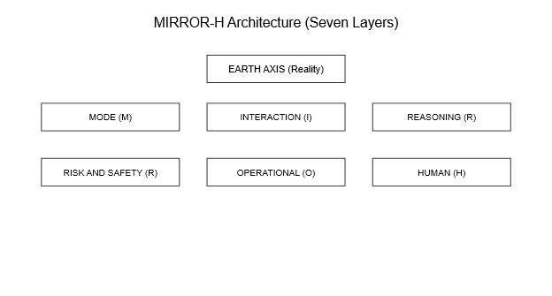
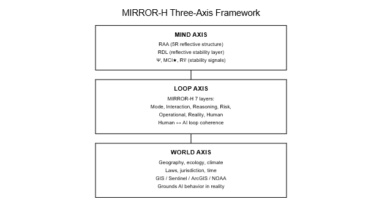
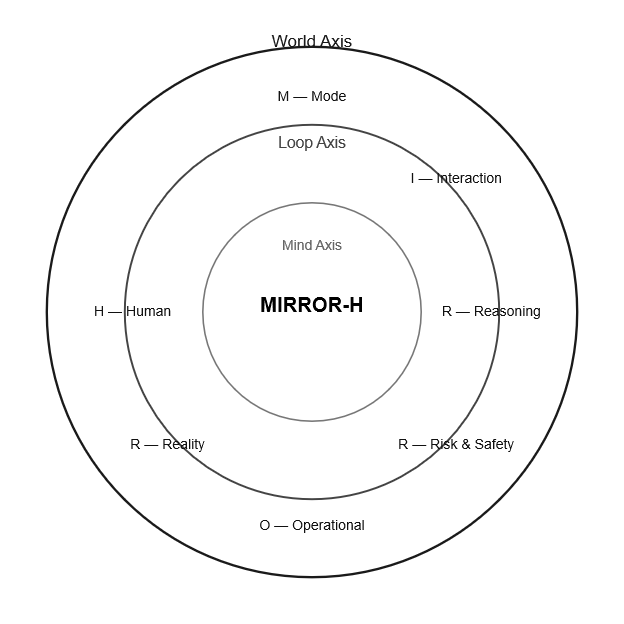
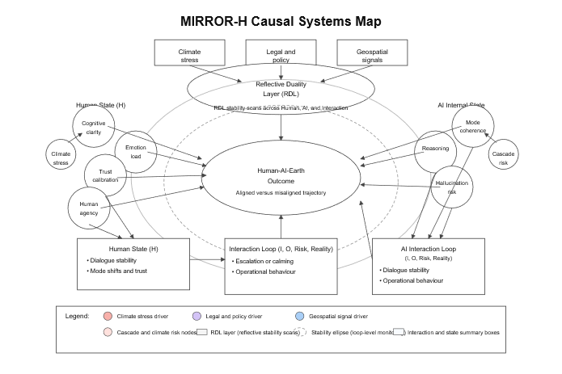
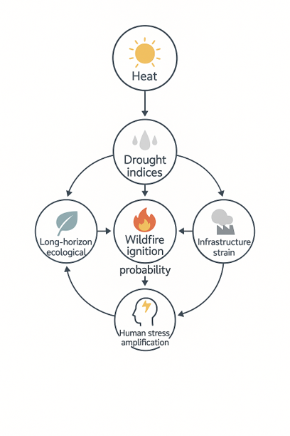
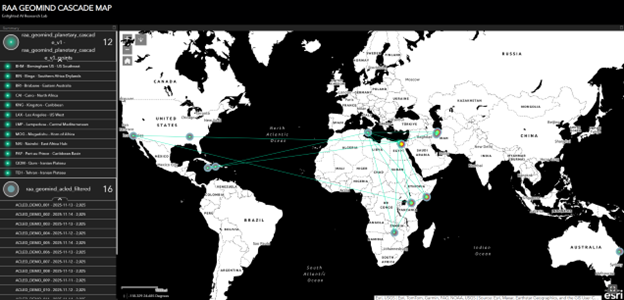

# Diagram Thumbnail Gallery

Quick visual index of the main **MIRROR-H** diagrams:

- Core architecture (axes, layers, interaction rings)
- Causal systems & convergence maps
- Earth-layer cascades & global dynamics

Each thumbnail opens its dedicated diagram page (`.md`) with caption and explanation.

---

## 1. MIRROR-H Core Architecture

| Seven-Layer Architecture | Three-Axis Framework | Mind–Loop–World Tri-System Map | Layer Interaction Rings |
| :----------------------: | :------------------: | :----------------------------: | :---------------------: |
|  |  |  |  |
| [Seven-Layer Architecture](MirrorH_Seven_Layer_Architecture.md) | [Three-Axis Framework](MirrorH_Three_Axis_Framework.md) | [Mind–Loop–World Tri-System Map](MirrorH_Mind_Loop_World_TriSystem_Map.md) | [Layer Interaction Rings](MirrorH_Layer_Interaction_Rings.md) |

---

## 2. MIRROR-H Causal Systems & Convergence Maps

| Causal Systems Map (v1) | Causal Systems Map (v2) | Causal Convergence Map | Functional Cascade Diagram |
| :---------------------: | :---------------------: | :--------------------: | :------------------------: |
|  |  |  |  |
| [Causal Systems Map (v1)](MirrorH_Causal_Systems_Map.md) | [Causal Systems Map (v2)](MirrorH_Causal_Systems_Map_v2.md) | [Causal Convergence Map](MirrorH_Causal_Convergence_Map.md) | [Functional Cascade Diagram](MirrorH_Functional_Cascade_Diagram.md) |

---

## 3. Earth-Layer Cascades & Global Dynamics

| Wildfire Cascade Dynamics | Global Cascade Timeline (Nov 2025) | ACLED Co-Activity During Cascade Window |
| :-----------------------: | :---------------------------------: | :--------------------------------------: |
|  |  |  |
| [Wildfire Cascade Dynamics](Wildfire_Cascade_Dynamics_Map.md) | [Global Cascade Timeline (Nov 2025)](Global_Cascade_Timeline_2025.md) | [ACLED Co-Activity During Cascade Window](ACLED_Coactivity_Cascade_Window_Map.md) |

---

## 4. Full MIRROR-H Diagram Index

For a text-based list of all diagrams (including any future additions), see:

👉 [DIAGRAMS.md](../DIAGRAMS.md)

Use this `GALLERY.md` for quick visual browsing, and `DIAGRAMS.md` for the complete detailed index.
