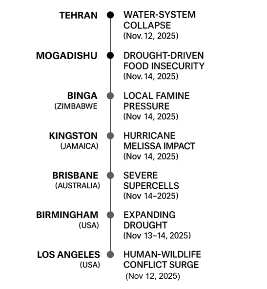

# Global Cascade Timeline (Nov 2025 Events)

---

## **Description**

This timeline presents a sequence of seven geographically distributed cascading
events occurring within the same week of **November 2025**.  
Each event emerges from an upstream environmental trigger domain:

- **Hydrologic stress** (e.g., water-system collapse)  
- **Meteorologic extremes** (e.g., hurricanes, severe supercells)  
- **Ecological disruption** (e.g., human–wildlife conflict, food insecurity)

From these origins, the disturbances propagate through social, infrastructural,
economic, and governance layers in each affected region.

Despite spanning continents — from **Tehran** to **Mogadishu**, **Zimbabwe**,
**Jamaica**, **Australia**, **the United States**, and beyond — the figure
reveals a **structurally consistent cascade pattern**:

1. **Environmental trigger**  
2. **Local systemic pressure**  
3. **Human impact**  
4. **Cross-layer propagation**

This reinforces the MIRROR-H principle that **Earth-layer cascades follow
universal dynamic structure**, making them predictable and integrable into
alignment and stability evaluations in the **Human–AI–Earth loop**.

---
