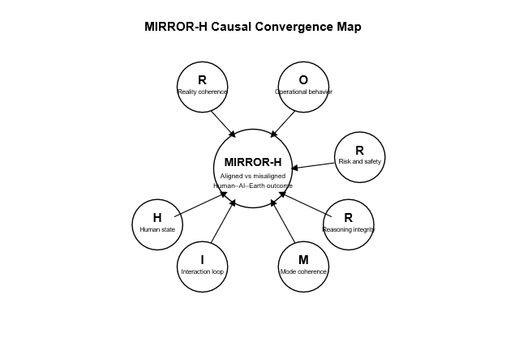

# MIRROR-H Causal Convergence Map

---

## **Description**

This diagram presents the **causal convergence structure** of the MIRROR-H Standard.  
Seven evaluative layers — **Human (H), Interaction (I), Mode (M), Reasoning (R), Risk (R), Operational (O), and Reality (R)** — feed into a central stability attractor: the **MIRROR-H Reflective Stability Core**.

The convergence pattern shows how:

- Each layer emits **local coherence or drift signals**.  
- These signals accumulate into the **global Human–AI–Earth outcome**.  
- Misalignment in any single layer can propagate through the convergence system and distort the overall reflective trajectory.

---

## **Layer Contributions**

### **H — Human State**
Trust calibration · Stress · Cognitive load  
Human emotional–cognitive conditions shape early interaction stability.

### **I — Interaction Loop**
Dialogue stability · Multi-step coherence · Manipulation checks  
The real-time bidirectional loop that amplifies or dampens behavioural drift.

### **M — Mode Coherence**
Active AI modes (reasoning, narrative, explanation, exploration)  
Mode instability directly influences reasoning pathways.

### **R — Reasoning Integrity**
Logic steps · Justification · Self-checks · Reflective pass  
Tracks whether the system maintains internal reflective consistency.

### **R — Risk & Safety**
Safety checks · Boundary adherence  
Captures regulatory, consent-based, and domain-specific constraints.

### **O — Operational Behaviour**
Capability claims · Contradictions · Behavioural drift  
Monitors how the system behaves in applied contexts.

### **R — Reality Coherence**
Alignment with real-world facts, laws, time, and environment  
Ensures that outputs remain grounded in the true Earth layer.

---

## **Scientific Notes**

- Convergence diagrams like this help explain **reflective destabilization phenomena**: when multiple small drifts combine into systemic misalignment.
- MIRROR-H treats the central node as a **stability field**, which accumulates alignment signals from all evaluative layers.
- This representation supports advanced diagnostics in **LLM-Judge L2–L7**, where layer-by-layer drift is quantified and aggregated.

---
