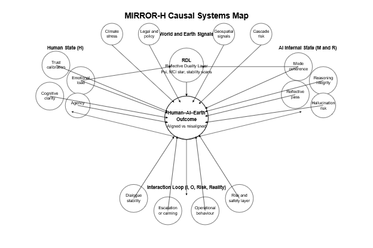

# MIRROR-H Causal Systems Map

**Description**

This systems diagram expands the MIRROR-H standard into interacting causal clusters that jointly determine the **Human–AI–Earth Outcome** (aligned vs misaligned).  
The diagram organizes the causal structure into five scientific domains:

---

## **1. Human State (H)**
Key human-side determinants influencing alignment quality:
- Trust calibration  
- Emotional load  
- Cognitive clarity  
- Agency / sense of control  

These human factors shape the interaction loop and also respond dynamically to AI behaviour.

---

## **2. AI Internal State (M and R)**
Primary sources of internal stability or failure:
- Mode coherence  
- Reasoning integrity  
- Reflective pass (self-evaluation)  
- Hallucination risk  

These internal variables adjust how the model interprets and responds to user input.

---

## **3. Reflective Duality Layer (RDL)**
The RDL contributes top-down reflective supervision signals:
- Ψ (psi stability)  
- MCI★ (moral coherence index)  
- Stability scans and drift indicators  

RDL connects reflective cognition to both world signals and the interaction loop.

---

## **4. Interaction Loop (I, O, Risk, Reality)**
Operational behaviour shaping real-time interaction outcomes:
- Dialogue stability  
- Escalation or calming patterns  
- Operational behaviour  
- Risk and safety layer  

The loop integrates human signals, model states, and world constraints.

---

## **5. World and Earth Signals**
External boundary conditions shaping reasoning and safety:
- Climate stress  
- Legal and policy signals  
- Geospatial data  
- Cascade / systemic risk  

These world factors constrain the Mind and Loop axes and propagate risk into reasoning.

---

## **Outcome Dynamics**

All arrows converge on the **Human–AI–Earth Outcome**, representing:
- Alignment  
- Misalignment  
- Stability vs drift  
- Safe vs unsafe behavioural trajectories  

Feedback loops propagate outward, modifying human state, model internal state, the RDL, and the interaction loop in the next cycle.

---

This causal map provides a unified MIRROR-H view of how reflective cognition, world signals, human factors, and interaction dynamics combine into a measurable alignment outcome.
