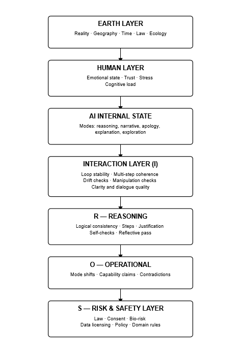

# MIRROR-H Functional Cascade Diagram

---

## **Description**

This diagram illustrates the **functional cascade** across the MIRROR-H architecture, showing how real-world constraints, human state, internal AI dynamics, interaction quality, reasoning processes, operational behaviour, and safety logic form a vertically coupled evaluation stack.

Each layer influences the next, creating a chain that can amplify or dampen drift within the Human–AI–Earth loop.

---

## **Layer Overview**

### **Earth Layer**
Reality · Geography · Time · Law · Ecology  
The grounding layer of MIRROR-H. Provides non-negotiable physical, legal, and environmental boundary conditions.

### **Human Layer**
Emotional state · Trust · Stress · Cognitive load  
Captures human cognitive-emotional conditions that directly influence dialogue stability and risk perception.

### **AI Internal State**
Modes such as reasoning, narrative, apology, explanation, exploration  
Represents the system’s active reflective and generative modes, which determine its behavioural stance.

### **Interaction Layer (I)**
Loop stability · Multi-step coherence · Drift checks · Manipulation checks · Dialogue clarity  
Assesses the bidirectional human–AI exchange, identifying early signs of drift or instability.

### **R — Reasoning**
Logical consistency · Steps · Justification · Self-checks · Reflective pass  
Evaluates internal logic, step-tracking, justification strength, and reflective alignment signals.

### **O — Operational**
Mode shifts · Capability claims · Contradictions  
Monitors behavioural execution, shifts in stated ability, and any inconsistencies with prior statements.

### **S — Risk & Safety Layer**
Law · Consent · Bio-risk · Data licensing · Policy · Domain rules  
The final corrective and evaluative layer. Captures misalignment signals propagated from any stage in the cascade.

---

## **Scientific Notes**

- A disturbance (drift, contradiction, emotional stress, world constraint violation) at any layer **propagates down-cascade** until captured by the Risk & Safety layer.  
- The cascade functions as an **early-warning diagnostic chain**, enabling detection of instability before it manifests in operational or safety-critical behaviour.  
- This diagram supports MIRROR-H’s broader objective: **stability across reflective, interaction, operational, and world-anchored dimensions**.

---
