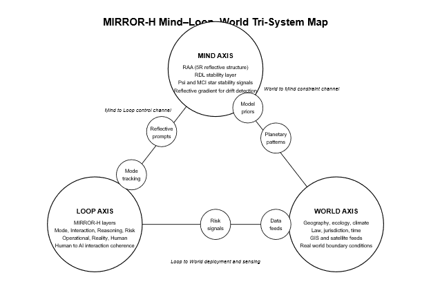

# MIRROR-H Mind–Loop–World Tri-System Map

**Description**

This diagram depicts MIRROR-H as a coupled tri-system.  
The **Mind Axis** encodes RAA and RDL with stability signals such as Ψ (Psi) and MCI★.  
The **Loop Axis** represents the seven MIRROR-H layers governing the Human → AI interaction cycle.  
The **World Axis** captures geospatial, legal, ecological, and planetary constraints that shape AI behavior.

Edge nodes along the triangular structure illustrate the primary control channels:

- **Mind → Loop:** Reflective prompts and mode tracking  
- **Loop → World:** Deployment actions and environmental sensing  
- **World → Mind:** Planetary constraint patterns influencing the reflective model

Together, these three axes define the full reflective ecosystem through which MIRROR-H maintains stability, coherence, and grounded alignment across reasoning, interaction, and reality.
